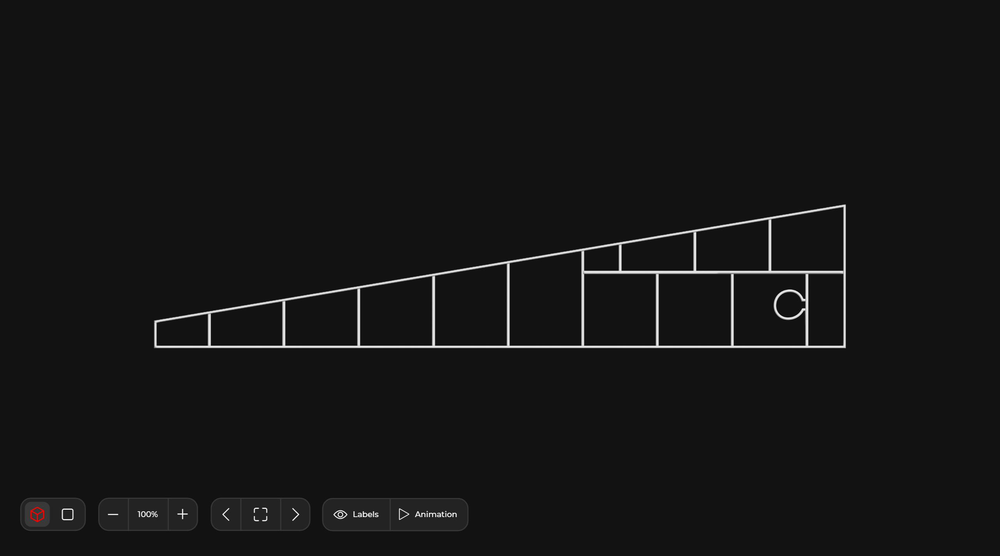
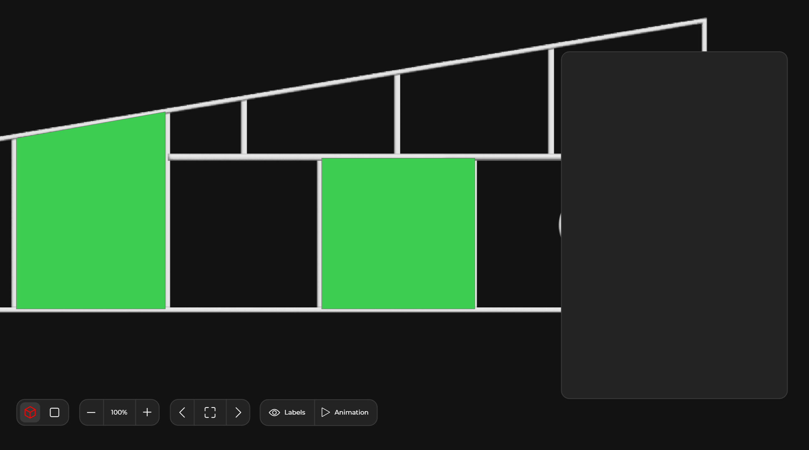
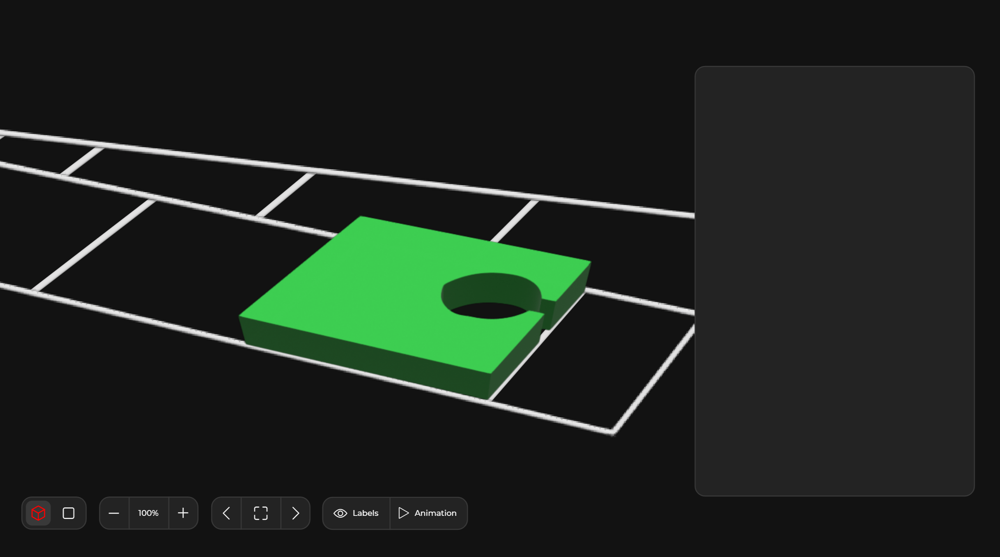

**Objective**: Develop a Vue.js component (compatible with TypeScript or JavaScript) for visualizing a plan with embedded, interactively highlightable objects. The component will receive data as a JSON array and should be responsive, adapting to its container's size.

#### Functional Requirements
1. **Performance**: The visualization must be high-performance, handling data rendering and animations efficiently for small and big plans
2. **Responsiveness**: The component should fit within its parent container, adjusting dynamically to different screen sizes and orientations.
3. **Data Handling:** The input for the plan and objects will be a JSON array containing coordinate data. The component should parse and render this data accurately.
4. **Technology Stack:** The website uses Vue.js with TypeScript. The component may use JavaScript. Libraries like three.js are acceptable for rendering and animation purposes.

#### Terminology and Features
- **Top View:** A default state, where the plan is displayed without any highlighted objects.
- **Detail View**: An interactive state where one or more objects are highlighted and enlarged, with the view zooming into these objects. Only one of the highlighted objects is shown in detail and centered, but the other are also highlighted in the background.
- **Top Mode**: A viewpoint from above, applicable in both Top View and Detail View.
- **Perspective Mode**: A side perspective view for the Detail View, while maintaining a top-down view for the Top View.

#### Component Props and Emits
- **PANEL:** A JSON array representing the plan, including contour coordinates of objects.
- **ANIMATION_ZOOM:** Boolean to control zoom animation between Top View and Detail View.
- **ANIMATION_ROTATE:** Boolean to set whether the plan should rotate slowly around its axis in Idle State.
- **TOP_SCALING** & **DETAIL_SCALING**: Variables to control the zoom level of the plan and objects, respectively.
- **PANEL_COLOR** & **BACKGROUND_COLOR**: Variables to set the color of the plan and background.
- **HIGHLIGHTED_OBJECTS**: Array of objects to be highlighted, with attributes for ID, color, and a `is_shown` flag.
- **CURRENT_OBJECT**: Command to change the focus to a new object in the Detail View (toggle `is_shown` flag)
- **TEMPORARY_VIEW**: Command to toggle between Top View and focused object in Detail View.
- **MODE**: Variable to switch between Top Mode and Perspective Mode.

#### Generation of Objects and Plan from JSON Data
The visualization component should be designed to construct a detailed plan and its associated objects based on JSON data, which primarily comprises contour coordinates. Here's a brief overview of how this process works:
- **JSON Data Structure**: The provided JSON array contains sets of contour points. Each set represents the boundary or outline of an individual object within the plan. These points are defined by their coordinates.
- **Parsing the Data**: Upon receiving the JSON data, the component parses it to extract the contour points. Each set of points is treated as a distinct entity, corresponding to a specific object in the plan.
- **Constructing the Plan**: The plan itself is created by laying out these objects according to their contour points. The visualization component maps these points onto a 2D or 3D space (depending on the mode) to recreate the plan's layout accurately.
- **Object Generation**: Each object within the plan is generated by connecting its contour points. This forms the shapes or outlines of the objects as they exist within the plan. The generation process ensures that each object is distinctly represented, adhering to its specific contour.
- **Rendering**: Finally, the plan, along with its objects, is rendered visually in the component. This rendering respects the spatial relationships and dimensions as dictated by the contour points, offering a true-to-scale representation of the plan and its elements.

#### Visualization Details
Top View:
- The plan rotates slowly around it's axis in Idle State when ANIMATION_ZOOM is true
- No distinction between Top Mode and Perspective Mode.

Detail View:
- In Top Mode, all passed objects in HIGHLIGHTED_OBJECTS are highlighted, but the visualisation is zoomed in on the object, which has the flag `is_shown` true. The visualisation slowly rotates in Idle State. A top view is shown without 3D effect.
- In Perspective Mode, a side view is shown with 3D effect, all passed objects in HIGHLIGHTED_OBJECTS are highlighted, but the visualisation is zoomed in on the object, which has the flag `is_shown` true. The visualisation slowly rotates in Idle State. 

#### Visual Context
The focus is solely on the visualization component; other UI elements will overlay this component.

PERSPECTIVE MODE and TOP VIEW without any highlights.

TOP MODE and TOP VIEW with Highlights. The middle one has the flas `is_shown` true.

PERSPECTIVE MODE and TOP VIEW with Highlights. The middle one has the flas `is_shown` true.

#### Animation Transitions
- **Idle State**: The plan rotates slowly based on the ANIMATION_ROTATE setting.
- **Top View to Detail View**: Animated transition with rotation and zoom based on MODE. Objects grow out of the plan.
- **Detail View to Top View**: Objects retreat into the plan with rotation and zoom out.
- **Changing Highlighted Objects**: Smooth transition between objects with an animated tracking shot.
- **Scaling Changes**: Animated zoom to new scaling levels as specified by TOP_SCALING and DETAIL_SCALING.

The component should handle two distinct scenarios when transitioning from the Detail View back to the Top View:

1. **Transitioning with an Empty `HIGHLIGHTED_OBJECTS` Array**:
    - **Trigger**: This transition is initiated when an empty `HIGHLIGHTED_OBJECTS` array is passed to the component.
    - **Behavior**: All currently highlighted objects smoothly retract into the plan's surface, symbolizing a deactivation of their highlighted state. Simultaneously, the view quickly rotates back to its original Top View position and zooms out to the default scale.
    - **Post-transition State**: The component resumes a slow rotation around the plan's axis, now in the Top View with no objects highlighted.
2. **Transitioning with a New `HIGHLIGHTED_OBJECTS` Array**:
    - **Trigger**: This transition occurs when a new `HIGHLIGHTED_OBJECTS` array is passed, indicating a change in the objects to be highlighted.
    - **Behavior**: The transition involves two phases:
        - **Phase 1 - Retraction**: Similar to the first case, current highlighted objects retract into the plan, and the view rotates back to the Top View position.
        - **Phase 2 - Highlighting New Objects**: Immediately following the retraction, the component transitions to highlighting the new objects. The new objects emerge from the plan's surface, and the view zooms in and rotates to focus on these newly highlighted objects.
    - **Post-transition State**: After the two-phase transition, the component settles into the Detail View focusing on the new set of highlighted objects. The slow rotation around the axis of the newly highlighted object or objects commences.

These transition behaviors ensure a seamless and dynamic user experience as the visualization adapts to changes in the highlighted objects, whether it's transitioning to a state with no highlights or shifting focus to a new set of highlights.

#### Deliverables
- A fully functional Vue.js component with the above specifications.
- Documentation for props and emits.
- Example usage and integration guide.
